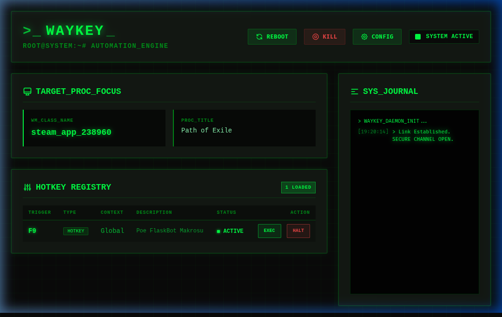

<div align="center">
  
  <h1>WayKey</h1>
  <p><b>Yeni Nesil Linux Otomasyon Motoru (Wayland & Hyprland Uyumlu)</b></p>
  <p><i>Linux için AutoHotkey ve xdotool'un modern, hızlı ve engellenemeyen alternatifi.</i></p>

  <p>
    
    
    
    
    
  </p>
</div>

<p align="center">
  <a href="README.md">🇬🇧 Click Here for English Documentation</a>
</p>

---

## 🌟 WayKey Nedir?

**WayKey**, Windows'taki AutoHotkey'e benzer karmaşık makrolar, tuş atamaları (remapping) ve aktif pencereye duyarlı (context-aware) kısayollar yazmanızı sağlayan Linux tabanlı bir arkaplan daimonu ve Siber (Cyberpunk) Web Dashboard'udur.
Doğrudan Linux'un çekirdek modülü olan `uinput` ve Hyprland'ın IPC (Socket) verileriyle konuştuğundan, Wayland (Gnome, KDE, Hyprland) bestecilerinin engelleyici küresel kısayol mimarilerini tamamen bypass eder.

<p align="center">
  
</p>

---

## 🚀 Özellikler

* 🛡️ **Mükemmel Wayland Uyumluluğu**: Görüntü sunucusu engellemelerini görmezden gelerek doğrudan `/dev/uinput` çekirdek donanım sürücüsüyle çalışır.
* 🎯 **Hyprland Pencere Takibi**: Aktif pencerelerin isimlerini anlık okur. Sadece "firefox" veya belli bir oyunda çalışan size özel botlar yazın!
* 💻 **Siber Kontrol Paneli**: `localhost:8080` adresinden açılan fütüristik kontrol panelinden çalışan kısayollarınızı görün, `EXEC/HALT` tuşlarıyla açıp kapatın ve log akışını okuyun.
* 🧠 **Akıcı JavaScript API'si**: Karmaşık ve eski dillere (bash, ahk) boğulmak yerine konfigürasyonunuzu bildiğiniz saf, modern JavaScript ile yazın.
* 🔄 **Dahili `.loop()` Yönetimi**: Çöken veya durmak bilmeyen `setInterval` belalarına son. Dashboard'dan anında durdurulabilen hatasız döngüler kullanın.
* ⚡ **Sıfır Kesintili Güncelleme (Hot-Reload)**: Konfigürasyon dosyanızı kaydettiğiniz anda WayKey kapanmadan kendini yeniler!

---

## 📦 Kurulum (Nasıl Yüklenir?)

WayKey, tüm modern Linux dağıtımlarına kolayca uyum sağlaması için "Tek Tık Evrensel Kurulum" sistemine sahiptir.

### Gereksinimler
- `nodejs` ve `npm`
- `make`, `gcc`, `g++` (C++ kütüphanelerinin sisteme derlenmesi için)
- `git`

### 🛠️ Tek Tıkla Evrensel Kurulum

Terminali açın, bu depoyu indirin ve otomatik kurulumu başlatın:

```bash
git clone https://github.com/yourusername/HypeKey.git
cd HypeKey
chmod +x install.sh
./install.sh
```

**Betiğin Arka Planda Yaptıkları:**
1. Gerekli JavaScript kütüphanelerini (`npm install`) kurar.
2. Sistemi simüle edecek Donanım simülatörü kodlarını (C++) bilgisayarınıza özel derler.
3. Udev kurallarını yazarak makinenin klavye yaratmasına (root olmadan) izin verebilmesi için bir kez `sudo` parolası sorar.
4. `waykey.service` isminde bir Systemd servisi yaratıp otomatik başlatır.
5. Masaüstü menünüze "WayKey Dashboard" adında bir uygulama kısayolu çıkartır. Ekrana tıklayarak paneli açabilirsiniz.

### Durum Onayı
Sistemin çalıştığına emin olmak servis yöneticisine bakabilirsiniz:
```bash
systemctl --user status waykey
```

---

## 📖 Başlangıç ve Konfigürasyon

Kurulumdan sonra tüm sistemin kalbi `~/.config/waykey/waykey.config.js` dosyasıdır. Web arayüzündeki **CONFIG** butonuna tıklayarak bilgisayarınızdaki metin editörüyle hemen açabilirsiniz.

### Örnek Yapı:
```javascript
module.exports = (WayKey) => {
    // 1. Basit bir Uygulama Çalıştırıcı
    WayKey.bind('Super+T')
          .description('Kitty Terminal Başlatır')
          .execute(() => {
              require('child_process').exec('kitty &');
          });

    // 2. Pencereye Özel Spam Bot (F9 ile Açık/Kapalı)
    WayKey.bind('F9')
          .whenActive('path of exile') // Aktif Odak!
          .description('Otomatik Can İksiri İçici')
          .loop(3500, async () => {
              WayKey.device.emitKey(WayKey.Keys.KEY_1, true);
              WayKey.device.emitKey(WayKey.Keys.KEY_1, false);
          });

    // 3. Metin Kısaltması (Siz btw yazdıkça "by the way" yazar)
    WayKey.hotstring('btw', 'by the way')
          .description('Mesajlaşma kısaltması');
};
```

---

## 📚 Kapsamlı Dokümantasyon
Motorun API'sini (tuş hex kodları) öğrenmek ve kendi script senaryolarınızı yazmak için rehberleri inceleyin:
* [API Kullanım Referansı (Fonksiyonlar ve Hex Tuşları)](API_REFERENCE.md)
* [Kullanım Kılavuzu (İpuçları ve Senaryolar Yazmak)](docs/waykey_user_guide_tr.md)

## 📄 Lisans
MIT License. Açık Kaynaktır! İstediğiniz gibi çatallayın ve geliştirin.
